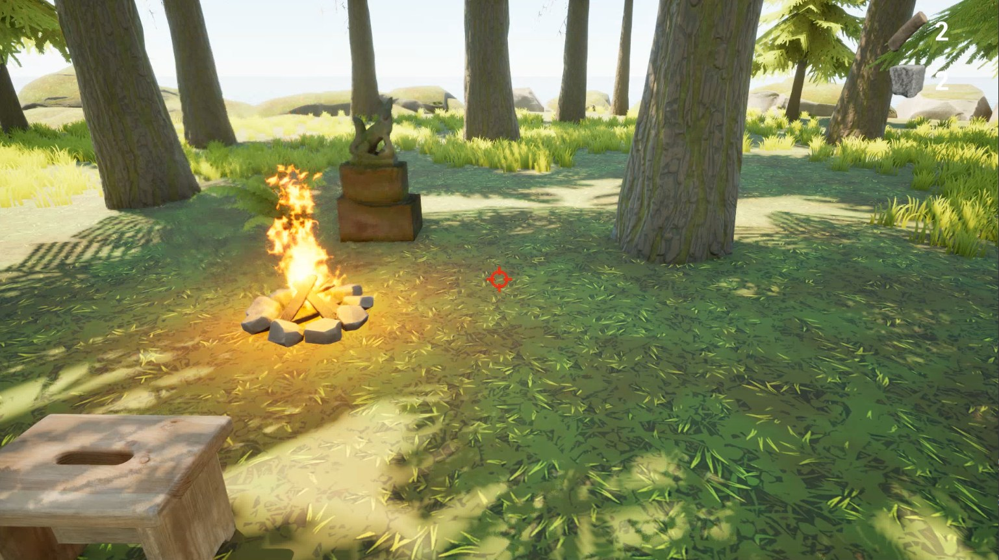
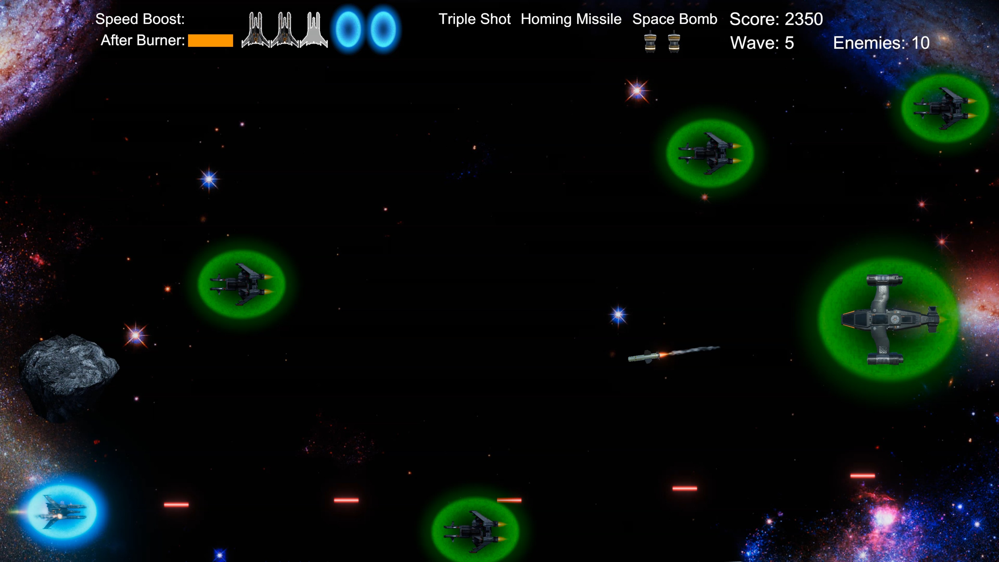
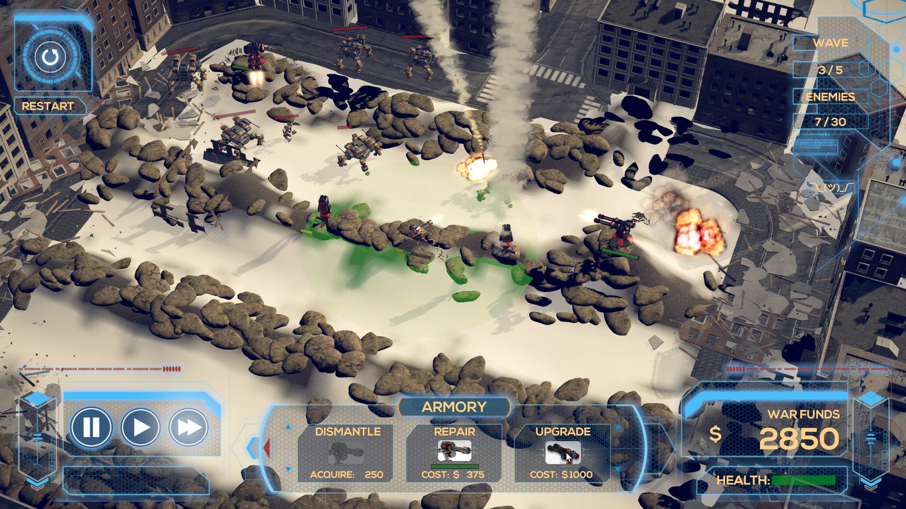

# 👋 Hi, I'm **Brian Stong**!
Game Developer | Unity Developer | C# Developer | Unreal Engine Developer | C++ Developer | Software Engineer

## ⚙️ Tech

## 🌐 Connect

## 🎮 Projects

## Cozy Island
A relaxing resource-gathering game inspired by calming ASMR audio.

- **Modular resource tracking system** for buildable actors  
- **Hybrid collision/line trace interaction system** with custom channels  
- **Dynamic footstep audio system** using physical material detection via trace  

---

## Galaxy Shooter
Horizontal space shooter with difficulty inspired by Dark Souls.

- **Multi-phase boss** with regenerating shields, destructible generators, and timed vulnerability  
- **Time-slowing boost**, homing missiles, and space bombs for high-impact tactical play  
- **Strategic power-up mechanics** that must be earned and used wisely  

---

## Mech Tower Defense
Endless tower defense game with deployable, repairable, and upgradeable towers.

- **Indirect-fire missile launcher** for targeting heavy mechs  
- **Responsive HUD** that flickers yellow on damage, turns red at low health, and resets on restart  
- **Tower mechanics** including deployment, repair, and upgrades for adaptive strategy  
